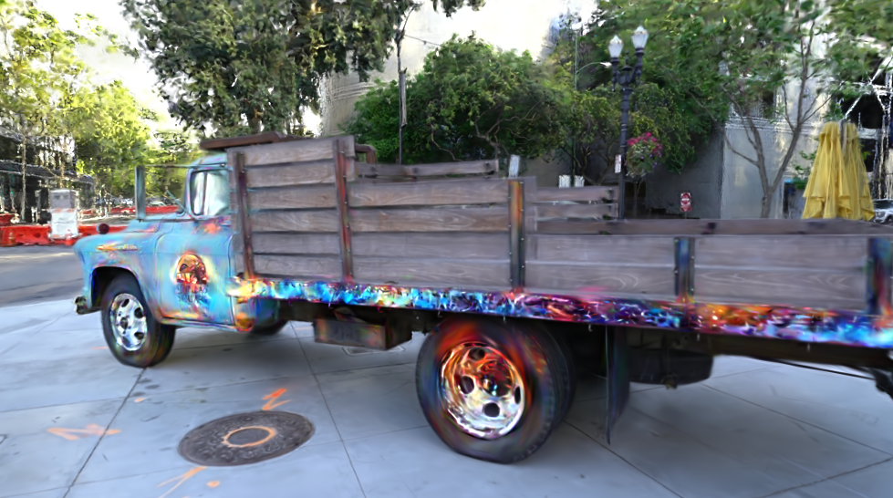
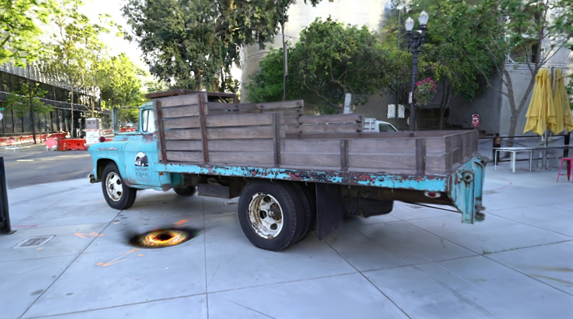
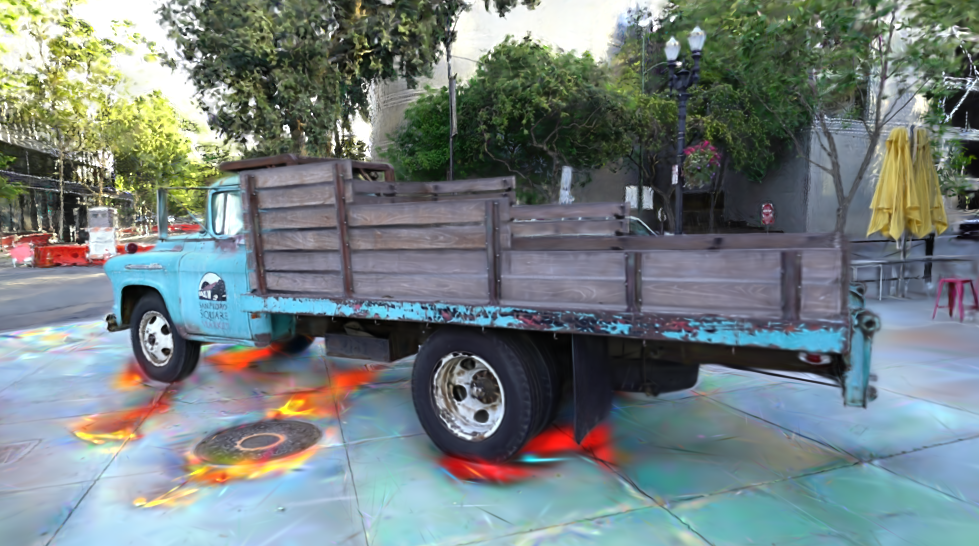
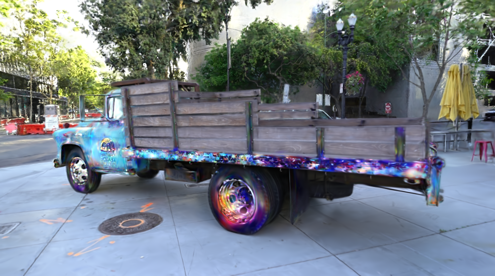
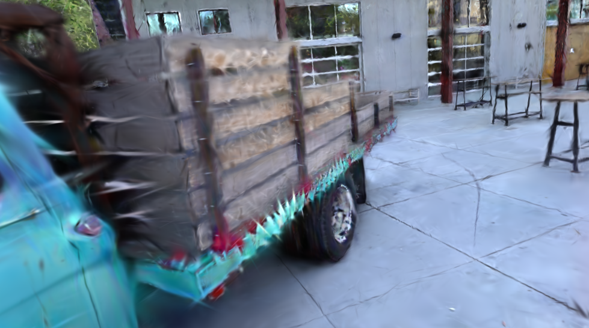
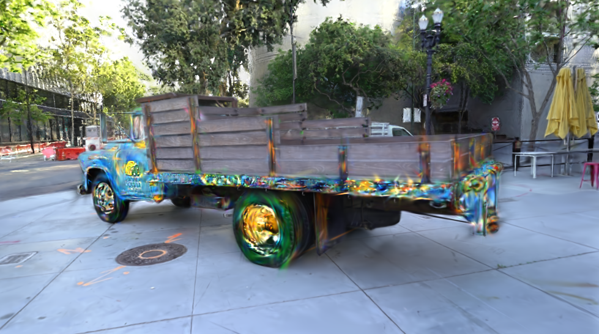

# FastText2ObjectStyle [📄 Project Paper](https://pdfupload.io/docs/0fd2681d)
<table>
  <tr>
    <td align="center">
      <br>
      <b>Flaming Truck</b>
    </td>
    <td align="center">
      <br>
      <b>Black hole Manhole Cover</b>
    </td>
  </tr>
</table>

## Installation

### Step 1: Clone the Repository
```bash
git clone https://github.com/Noe-Artru/FastText2ObjectStyle.git
```

### Step 2: Set Up the Environment
Note: we use micromamba but feel free to use your 
conda distrubtion of choice
```bash
micromamba create -f environment.yml
micromamba activate fast-text-2-obj
pip install -r requirements.txt
```

### Step 3: Install DEVA Tracking
```bash
pip install submodules/diff-gaussian-rasterization
pip install submodules/simple-knn
cd FastText2ObjectStyle
git clone https://github.com/hkchengrex/Tracking-Anything-with-DEVA.git
cd Tracking-Anything-with-DEVA
pip install -e .
bash scripts/download_models.sh
cd ..
```

## Preprocessing

### Step 1: Prepare Your Data
- Place your dataset in the `FastText2ObjectStyle/data` folder.
- Edit `scripts/prepare_pseudo_label.sh` to match your dataset’s parameters.

### Step 2: Generate Object Masks
```bash
bash script/prepare_pseudo_label.sh
```

### Step 3: Train Gaussian Splatting Model with Gaussian Grouping
Replace `truck` with the name of your dataset, and `-r 2` with your chosen resolution :
```bash
python train.py -s data/truck -r 2 \
--config config/gaussian_dataset/train.json --port 8000 \
-m outputs/truck
```

## Object Stylization

### Step 1: Identify the Object ID
- Use a color-picking tool to find the ID of the object you want to stylize from `data/<dataset>/object_mask`.
- Example tool: [Image Color Picker](https://imagecolorpicker.com/).

### Step 2: Create a Configuration File
- Create a configuration file similar to `config/object_style_transfer/truck.json`.
- Set the correct `object_id` for your target object.

### Step 3: Run the Stylization Loop
Replace `truck` with the name of your dataset and provide your style prompt:
```bash
python text_edit_object_style_transfer.py -m outputs/truck \
        --config_file "config/object_style_transfer/truck.json" --skip_test \
        --style_text "Your Prompt goes here"
```

### Step 4: Try out GS2GS based Stylization (Optional)
NOTE before trying with GS2GS, please update the cache directory under 
GaussianSplatting/ip2p.py to match a local folder of yours.
Replace `truck` with the name of your dataset:
```bash
python gs2gs_edit_object_style_transfer.py -m outputs/truck \
        --config_file "config/object_style_transfer/truck.json" --skip_test \
        --style_text "Your Prompt goes here"
```

## Various Results
<table>
  <tr>
    <td align="center">
      <br>
      <b>Fire Floor</b>
    </td>
    <td align="center">
      <br>
      <b>Galaxy Truck</b>
    </td>
  </tr>
</table>

<table>
  <tr>
    <td align="center">
      <br>
      <b>Spiky Truck</b>
    </td>
    <td align="center">
      <br>
      <b>Van Gogh Truck</b>
    </td>
  </tr>
</table>

## Acknowledgements
We would like to sincerely thank the authors of the following projects which serve as the basis for this project:

- [Style-Splat](https://github.com/bernard0047/style-splat)
- [Instruct-GS2GS](https://github.com/cvachha/instruct-gs2gs)

## License
This project is licensed under the Apache License 2.0. See the LICENSE file for details.

